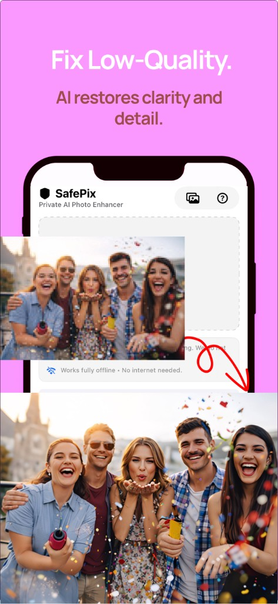
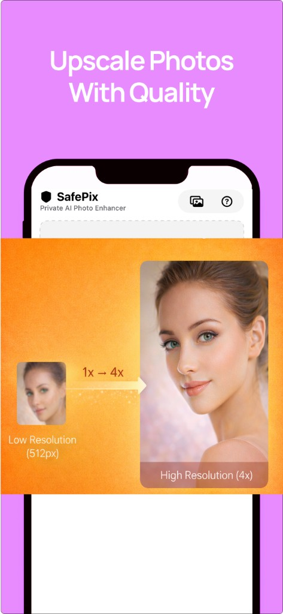
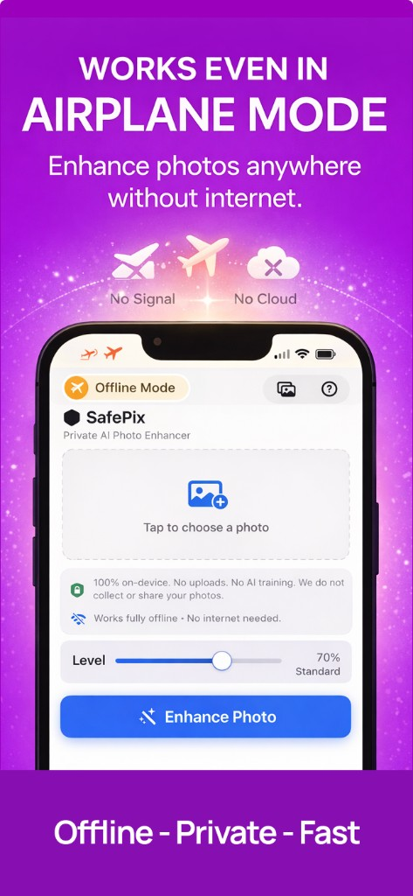
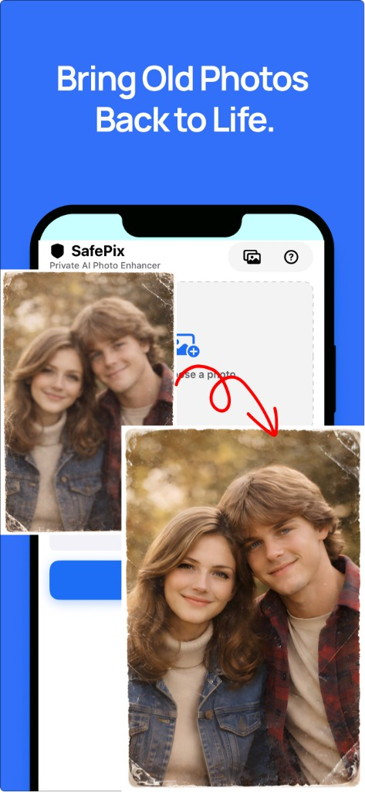
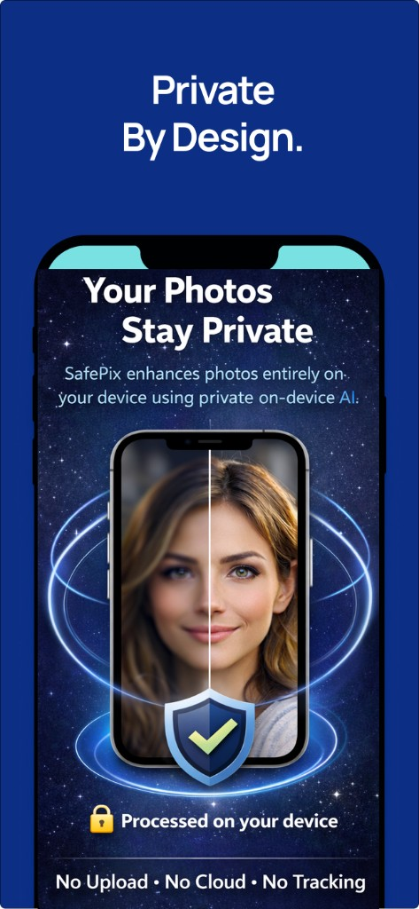
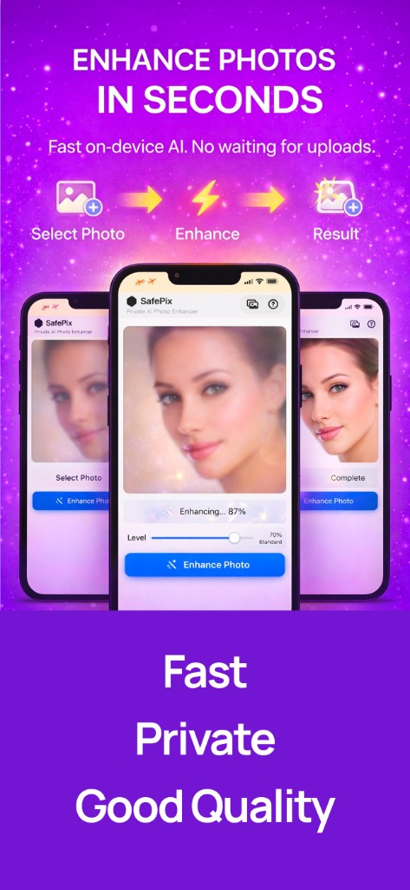

# SafePix – Private AI Photo Enhancer

**Bring blurry, low-quality photos back to life with powerful AI that runs entirely on your device.**

SafePix enhances your photos using advanced on-device AI. Restore details, upscale images, and sharpen faces—without ever uploading to the cloud. **Your photos stay private. Always.**

---

## What SafePix Does

### Restore blurry photos
Turn soft or low-quality photos into clear, detailed images. SafePix restores missing detail and improves clarity while keeping results natural.

### AI upscale without quality loss
Increase resolution while keeping natural detail. Safely upscale small or low-resolution images into larger, sharper photos.

**Perfect for:** old photos, cropped images, zoomed shots, small images from messaging apps.

### Improve faces and portraits
Enhance facial details while keeping natural skin texture. Eyes, hair, and features become clearer without looking artificial.

---

## Why SafePix Is Different

### Works completely offline
SafePix runs on your device using Apple’s Core ML. No internet needed.

Enhance photos on airplanes, while traveling, in remote areas—anywhere.

### Private by design
Your photos never leave your device. No cloud processing, no data collection, no uploads. Your memories stay private.

### Simple and fast
1. Choose a photo  
2. Tap **Enhance**  
3. Save your improved image  

Enhance photos in seconds.

---

## Perfect for

- Restoring old or damaged photos  
- Fixing blurry images  
- Improving portraits  
- Upscaling low-resolution images  
- Enhancing photos before sharing  

---

## FAQ

**Do you upload my photos?**  
No. SafePix processes everything locally on your device.

**Does SafePix require internet?**  
No. It works fully offline.

**What does SafePix do?**  
It enhances blurry photos, restores detail, upscales images, and improves faces using on-device AI.

**Do you collect user data?**  
No. We do not collect or store personal data or photos.

---

## Contact

**Email:** namtran1985vn@gmail.com  

For support, feature questions, or feedback, we’re happy to help.
